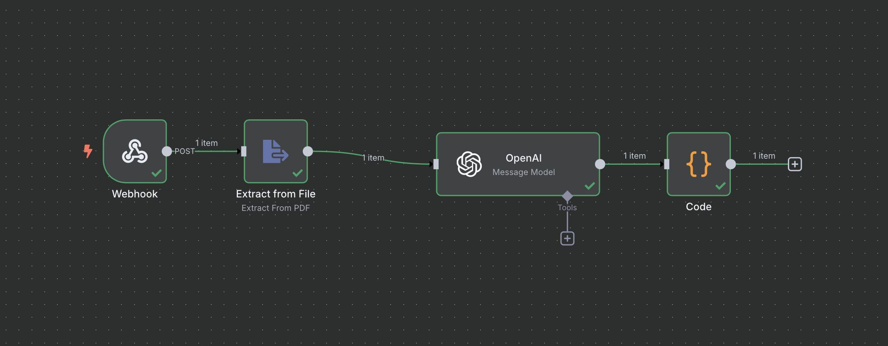
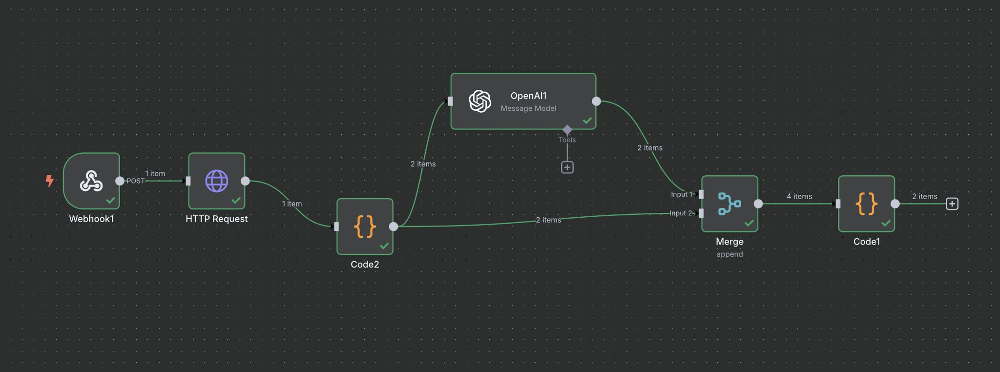
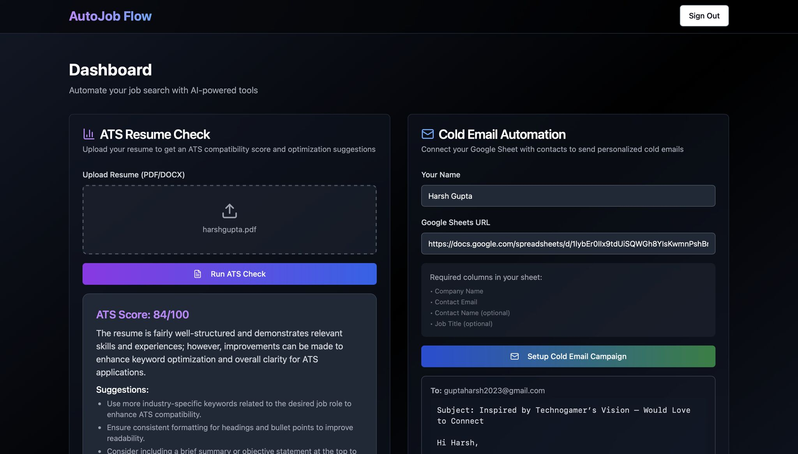

# Welcome to your Lovable project

## Project info
# 🚀 AutoJob Flow — Full Stack Cold Email Automation using n8n
> AI-Powered, Resume-Aware Outreach Automation for Job Seekers, Indie Hackers & Founders

  
  
  
  

---

## ✨ Overview

**AutoJob Flow** is an intelligent job outreach platform that:
- Extracts raw leads from Google Sheets
- Scores resumes using LLM-based logic
- Generates highly personalized cold emails
- Is fully automated using n8n + full stack

---

## 🧠 What It Does

- ✅ Google OAuth2 login — secure, passwordless
- ✅ Upload messy Google Sheets of leads (Name, Role, Company, LinkedIn, etc.)
- ✅ AI analyzes resumes (via OpenAI/Gemini) for relevance and ATS score
- ✅ Generates cold emails tailored to:
  - Role
  - Company
  - Resume content
  - Desired tone
- 🚧 Soon: Auto-send via Gmail API, track responses, and monitor via dashboard

---

## 🔍 Visual Walkthrough

### 🖼 Homepage
Elegant UI introducing the value of AI-powered job automation  

### 🧾 Dashboard & Resume Scoring
Upload resumes, link Google Sheets, view ATS compatibility score  

### ✉️ Generated Cold Emails
Each lead gets a personalized, tone-aware email — unique and high converting  

### ⚙️ n8n Flow
Self-hosted automation setup: webhook → parsing → OpenAI → merge → final output  

---

## ⚙️ Tech Stack

| Layer           | Tech                                         |
|-----------------|----------------------------------------------|
| **Frontend**    | React (Vite) + TailwindCSS                   |
| **Backend**     | Node.js + Express + MongoDB                  |
| **Auth**        | Google OAuth2 + JWT                          |
| **Automation**  | n8n (self-hosted)                            |
| **AI Models**   | OpenAI / Gemini (via HTTP request in n8n)    |
| **Data Input**  | Google Sheets                                |
| **Resume Logic**| Text extraction + LLM scoring via prompt     |

---

## 📂 System Architecture

